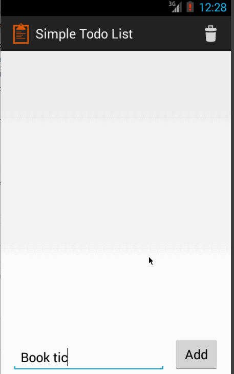

# SimpleTodoApp Demo

(Codepath Bootcamp Prework: SimpleTodoApp)

SimpleTodo is an Android application which allows users to maintain a list of their todo items.
A user can add, edit, delete items from the list.

Time spent: 10 hours.

Completed user stories:

 * [x] Required: User can view a list of todo items.
 * [x] Required: User can add a new todo item.
 * [x] Required: User can remove a todo item by long tapping on the item.
 * [x] Required: User can edit a todo item in a separate activity by tapping on the item.
 * [x] Optional: User is notified after editing an item.
 * [x] Optional: User can clear all items in the todo list by clicking the delete icon on the action bar of todo activity.
 * [x] Optional: The items list is persisted in the sqlite database and accessed using a custom content provider.
 
Notes:

Spent quite some time trying to figure out how to use content providers, write a custom provider, add an action bar menu item, using loader callbacks, etc.

The master branch has the basic app and the sqliteandclear branch has the optional features added.

The following gif walks through the completed user stories:

GIF created with [LiceCap](http://www.cockos.com/licecap/).
